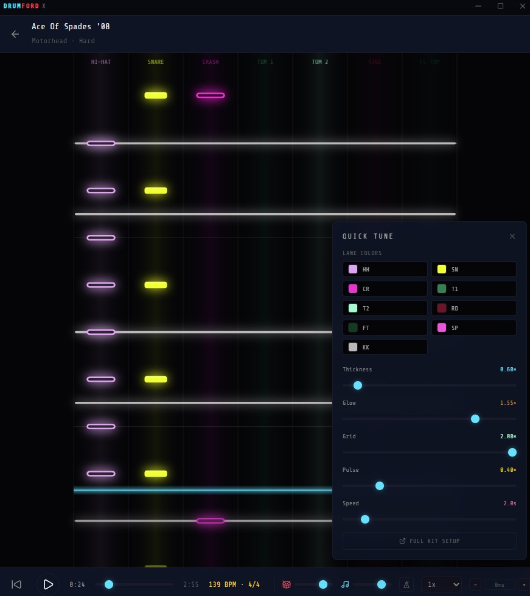
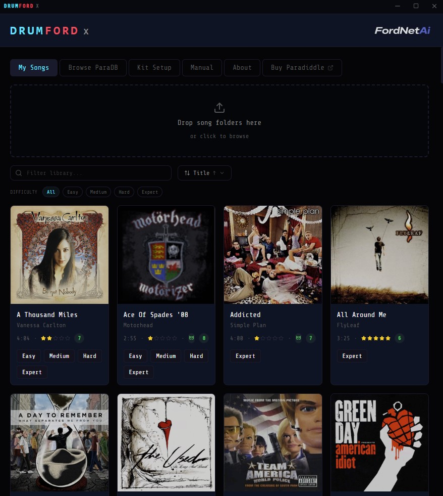
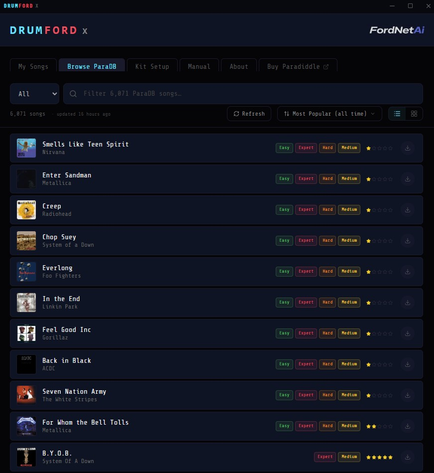
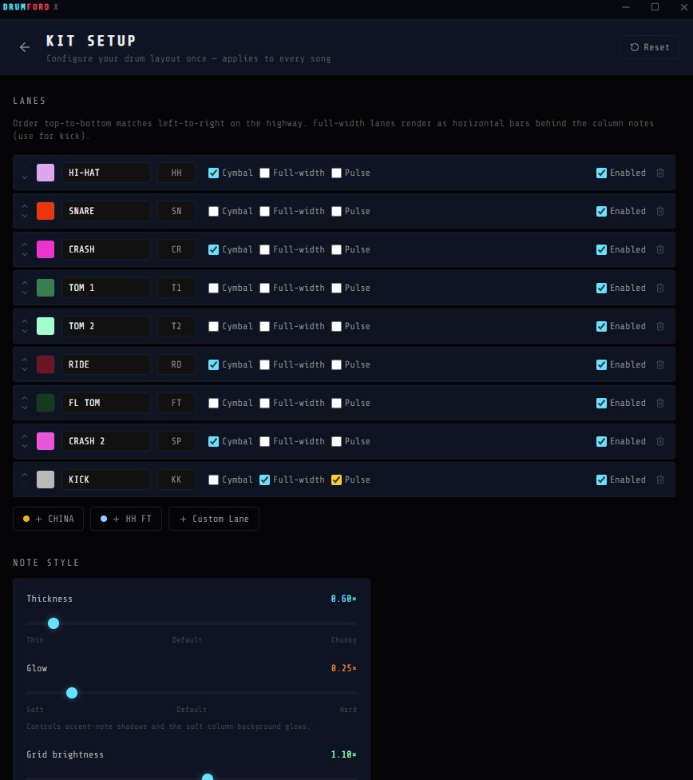
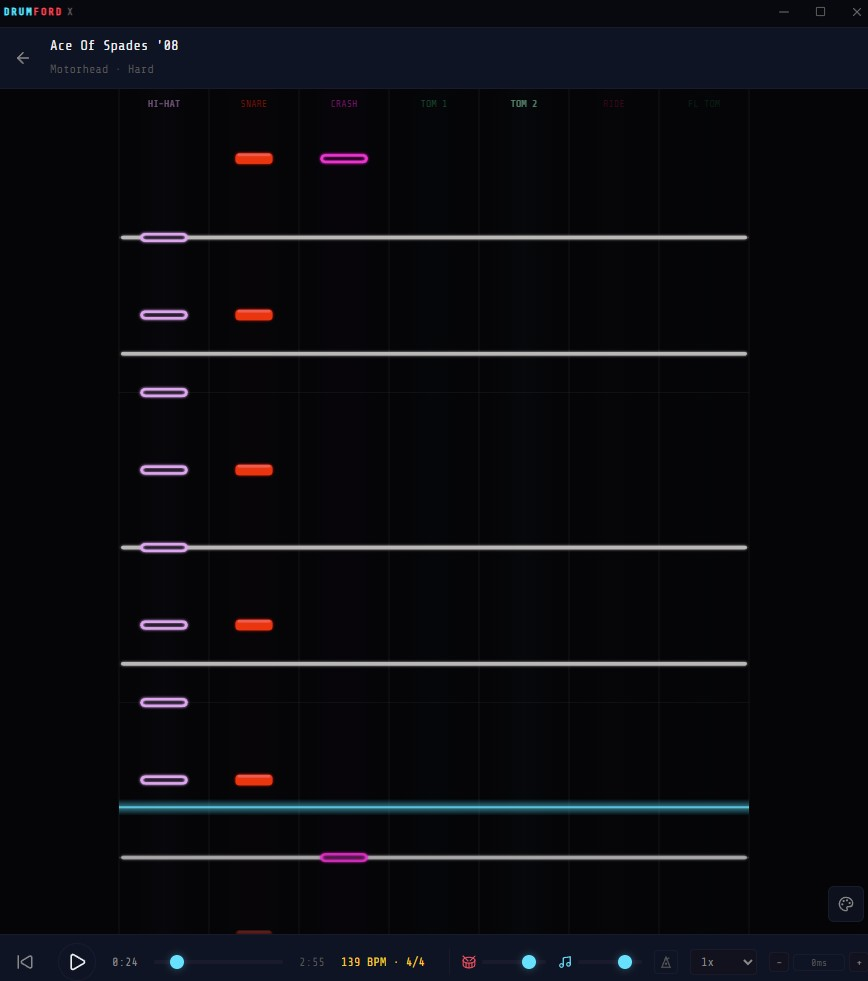

# DrumFord X

> Drum charts for real kits. Read charts on your desktop or tablet, right next to your kit.

DrumFord X is a flat-screen drum chart visualizer. It reads the open `.rlrr` chart format and pulls community-uploaded charts from [paradb.net](https://paradb.net), rendering the notes scrolling down a canvas highway you can read on a regular monitor or tablet — no headset, no controllers, just the chart and your kit.

Built by **[Fordnet](#about-fordnet)**.



🎬 [Watch the 30-second demo video](docs/screenshots/demo.mp4) *(plays inline on GitHub when you click)*

---

## What it is

- 🎯 **A read-only chart player.** Notes scroll down lanes synced to the original song audio. No scoring, no input detection, no drumming required — it's a visualization tool to read along on a real kit.
- 🥁 **Reads the open `.rlrr` chart format.** Parses every community chart, including multi-difficulty songs.
- 🌐 **Integrated Community Charts browser.** Search ~6,000 community charts from paradb.net, one-tap download, auto-import.
- ⚙️ **Customizable.** Reorder lanes, recolor notes, tune note thickness / glow / grid brightness / hit-line pulse / highway speed. Add or remove lanes (CHINA, SPLASH, HH-FOOT). Per-instrument routing for unusual charts.
- 🎚️ **Sync tooling.** Per-song speed (0.5×–1.5×), user-configurable sync offset (±2000 ms), metronome with BPM-event awareness, audio-output-latency-compensated timing.
- 💻 **Two platforms today.** Windows .exe (Electron) and Android APK (Capacitor wrapper). Same renderer code, same feature set.

## What it isn't

- ❌ **Not a game.** It doesn't track drumming, doesn't score you, doesn't detect input. It's a chart you read while you play your own kit.
- ❌ **Not a chart authoring tool.** It plays charts you've already authored or downloaded — it doesn't make new ones.
- ❌ **Independent project.** DrumFord X plays the open `.rlrr` drum-chart format and is not affiliated with, endorsed by, or connected to the makers of that format.
- ❌ **Not in any app store.** Downloads are direct from the GitHub releases page below.

---

## Screenshots

<table>
  <tr>
    <td width="50%"></td>
    <td width="50%"></td>
  </tr>
  <tr>
    <td width="50%" align="center"><em>Your library — sortable, filterable, cover-art aware</em></td>
    <td width="50%" align="center"><em>Community Charts — ~6,000 community charts, instant client-side search</em></td>
  </tr>
  <tr>
    <td width="50%"></td>
    <td width="50%"></td>
  </tr>
  <tr>
    <td width="50%" align="center"><em>Kit Setup — customize lanes, colors, shapes, and tuning sliders</em></td>
    <td width="50%" align="center"><em>Highway during playback — Ace of Spades, Hard difficulty</em></td>
  </tr>
</table>

---

## Install

### Windows (portable, no installer)

1. Download **`drumford-x-v0.1.0-win-x64.zip`** from the [latest release](https://github.com/FordNet-AI/drumford-x/releases/latest)
2. Right-click → **Extract All** to a folder of your choice (e.g. `C:\Apps\DrumFord X\`)
3. Double-click **`DrumFord X.exe`** to launch
4. **First-time warning:** Windows SmartScreen may show "Windows protected your PC" because this is an unsigned debug build. Click **"More info"** → **"Run anyway"**. This is expected for an alpha — code signing requires a paid certificate we haven't bothered with yet.

To uninstall, just delete the folder. No registry changes, no system bloat.

### Android (APK sideload)

1. Download **`drumford-x-v0.1.0-android.apk`** from the [latest release](https://github.com/FordNet-AI/drumford-x/releases/latest)
2. On your Android device, open the APK file via your file manager or browser downloads
3. Android will say "This type of file can harm your device" — that's the generic warning for non-Play-Store APKs. Tap **Install anyway** (or "Install from this source" once you grant permission).
4. **Samsung note:** if you have a Galaxy device, you may need to disable **Auto Blocker** first (Settings → Security and privacy → Auto Blocker → OFF). Samsung blocks sideloaded APKs by default.
5. Launch **DrumFord X** from your app drawer.

The APK is debug-signed, which is fine for sideloading but means it won't ever be on the Play Store from this signing key.

### Both platforms

After first launch, you'll land on an empty library. Two ways to get songs in:

- **Community Charts tab** — the easiest path. Loads a local cache of every public chart from paradb.net, one-tap downloads straight into your library.
- **Import a song zip** (Android) or **drag a folder onto the app** (Windows) — for charts you already have.

---

## Features

| | |
|---|---|
| 🎼 **Chart playback** | Scroll-down highway, kick as full-width bar, customizable color per lane, accent / ghost note styling, hollow cymbals |
| 🥁 **Hit-line pulse** | Visual feedback when triggering notes cross the hit line (configurable per-lane) |
| 📚 **Library** | Sort by Date Added / Title / Artist / Complexity / Duration. Filter by difficulty. |
| 🌐 **Community Charts browser** | Local catalog of all ~6,000 community charts from paradb.net. Instant client-side search. Sort by Most Popular / Trending (7d / 30d) / Newest / Complexity / A→Z. Compact list view + grid view. |
| 🎛️ **Kit Setup** | Per-lane reorder, color, kind (drum / cymbal / full-width), enable/disable, pulse-trigger, custom-name. Optional presets: CHINA, SPLASH, HH-FOOT. Advanced instrument-class remapping. |
| 🎚️ **Live tuning** | Highway speed, note thickness, glow intensity, grid brightness, hit-line pulse strength. All sliders, all persistent. |
| ⏱️ **Sync controls** | Per-song speed multiplier (0.5×–1.5×), per-user sync offset (±2000 ms, click-to-type), metronome with full BPM-event awareness |
| 🎨 **Visual polish** | Custom FordNetAi branding, dark-navy color palette, hit-line cyan glow, lane background gradients, beat grid (downbeats stronger) |
| ⌨️ **Keyboard shortcuts** | Space = play/pause, Esc = close any modal |
| 🪟 **Frameless window** | Custom title bar on Windows. Standard Android UI on tablet. |

## Known limitations

- **Audio latency on tablet:** Android's audio pipeline has higher latency than desktop. Use the **Offset** control to compensate (typically +50–100 ms on a tablet).
- **No drag-and-drop on Android:** Replaced with a "Import Zip file" picker. Community Charts is the primary import path.
- **No code signing:** Windows SmartScreen + Android "Install Unknown Apps" warnings. Both are click-through but cosmetically rough.
- **No chart authoring:** This is a player, not an editor. Author charts in a dedicated editor, then import them here.
- **Open hi-hat detection:** Not yet differentiated visually from closed hi-hat. The chart authoring community typically uses velocity to encode this; DrumFord X renders accent-velocity notes larger + with a glow, so well-charted songs already get visual distinction "for free."
- **Tempo changes:** Fully supported on the highway grid; tempo changes within a song re-anchor the beat grid correctly.

## Bugs / feedback

Open an issue: https://github.com/FordNet-AI/drumford-x/issues

Useful info to include:
- Platform (Windows or Android)
- App version (visible on the About tab)
- Song you were playing (link to the chart on paradb.net)
- What happened vs what you expected
- Browser console / adb logcat output if you can grab it

This is **alpha** — please report rough edges. That's literally why we shared.

---

## Build from source

### Requirements

- Node.js 22+ ([nodejs.org](https://nodejs.org))
- Git

### Run in dev (Windows / macOS / Linux)

```
git clone https://github.com/FordNet-AI/drumford-x
cd drumford-x
npm install
npm run dev:electron
```

Or on Windows the one-shot launcher: `start.bat`.

### Build Windows .exe

```
npm run build
npx electron-builder --dir   # produces release/win-unpacked/
```

The unpacked `.exe` sits at `release/win-unpacked/DrumFord X.exe`. To wrap as an NSIS installer you'd need Windows Developer Mode enabled (or Admin powershell) due to a symlink-extraction quirk in electron-builder. For alpha distribution the unpacked folder zipped is fine.

### Build Android APK

The `android-capacitor` branch has the Capacitor wrapper. CI builds the APK on every push to that branch and uploads it as an Actions artifact.

```
git checkout android-capacitor
npm install
npm run android:open        # opens Android Studio (needs JDK 21 + Android SDK)
# In Android Studio: Build → Build APK(s)
```

Easier path: download the APK from the [latest release](https://github.com/FordNet-AI/drumford-x/releases/latest).

### Regenerate icons

```
npm run icon            # regenerates public/icon.ico (Windows)
npm run android:icons   # regenerates android/app/src/main/res/mipmap-*/* (Android)
```

---

## Stack

Electron + Capacitor · React 19 · Vite 7 · TypeScript · Tailwind v4 · Zustand 5 · Web Audio API · IndexedDB (idb-keyval) · adm-zip + jszip

## Project layout

```
electron/         Electron main process (Windows shell, IPC, chart API, zip extraction)
src/
  components/   React UI
    highway/    Canvas renderer + lane logic
    library/    Song cards, Community Charts browser, import
    setup/      Kit Setup, Quick Tuner popover, Add-Lane modal
    controls/   Transport bar widgets
  stores/       Zustand stores (player, library, kit, ui)
  lib/          Pure modules (parser, default kit, song storage, catalog cache, capacitor bridge)
  types/        Shared types
android/        Capacitor Android shell (only on android-capacitor branch)
public/         Static assets (icon, Fordnet logo)
scripts/        Build helpers
docs/           rlrrschema.json — the .rlrr chart format spec, for reference
.github/        CI workflow (auto-builds Android APK)
```

---

## About Fordnet

Fordnet is the indie label behind DrumFord X. Built by Tim — drummer, builder, and recovering Quicken user — out of a desire to read drum charts on a flat screen next to a real kit, instead of strapping on a headset every time.

## Credits

- **paradb.net** — the community-run chart database DrumFord X integrates with for one-click downloads.
- **Every chart author** — every drummer who has ever taken the time to chart a song. This whole experience runs on your work.

## License

MIT. See [LICENSE](LICENSE).

**Trademark notice:** *DrumFord X* and *Fordnet* are trademarks of Fordnet. The MIT license grants permission to use the source code; it does not grant permission to use these names or the Fordnet logo on derivative works. If you fork the project, please rename your fork.

## Notice

DrumFord X is an independent project that plays the open `.rlrr` drum-chart format and is not affiliated with, endorsed by, or connected to the makers of that format. See [NOTICE.md](NOTICE.md) for the full statement of what this project does and doesn't redistribute.
